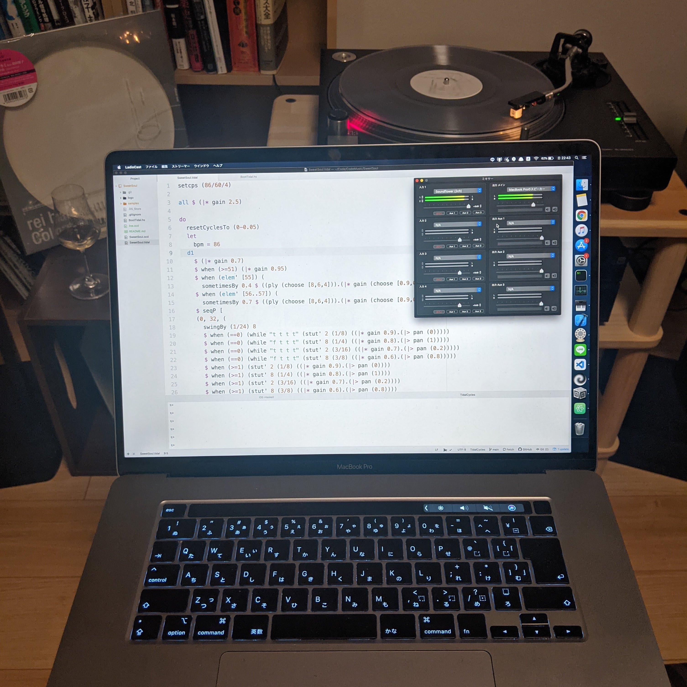
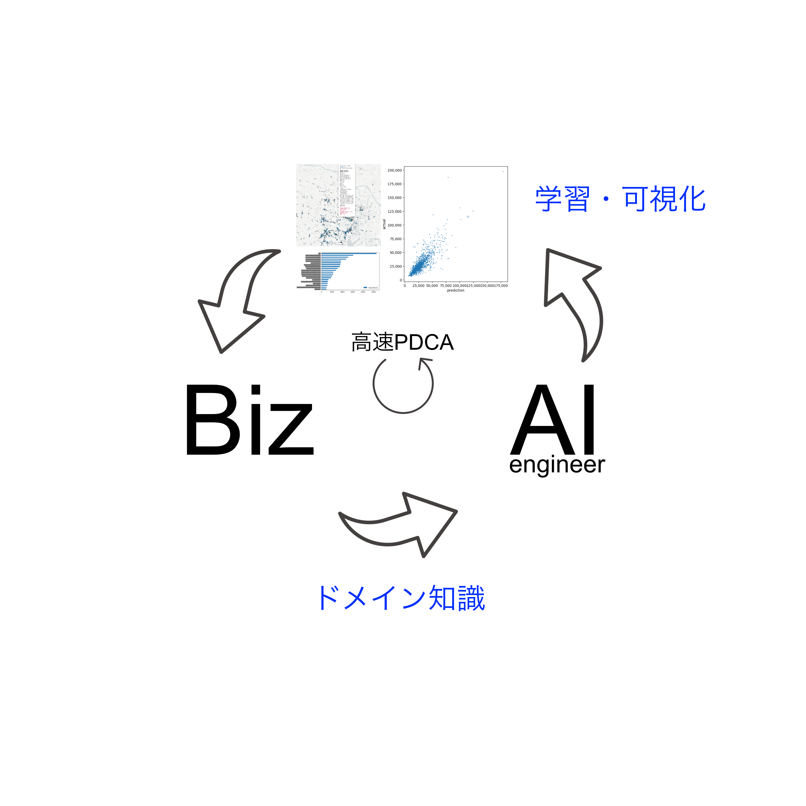
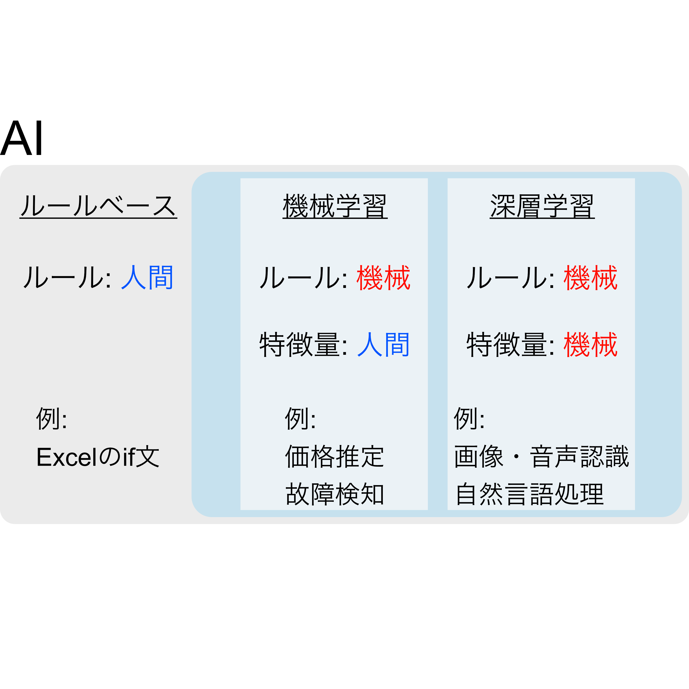
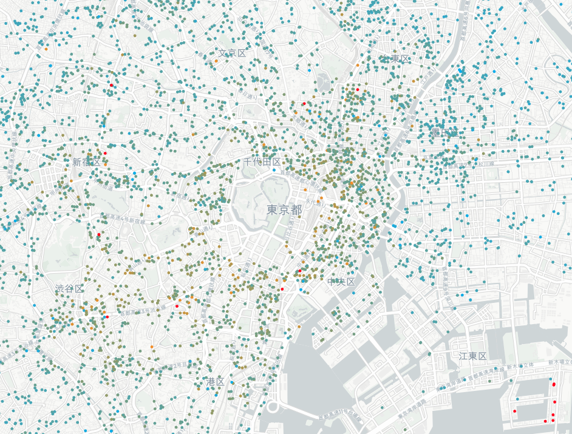
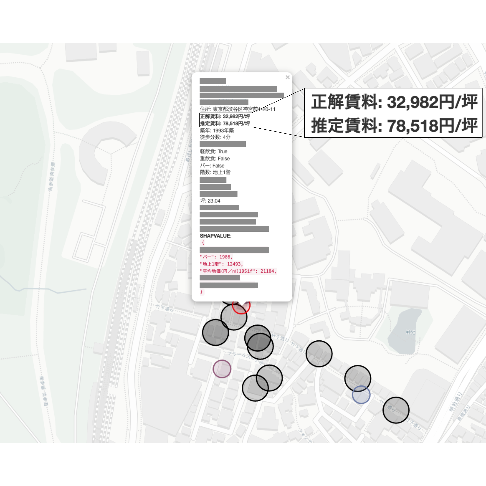
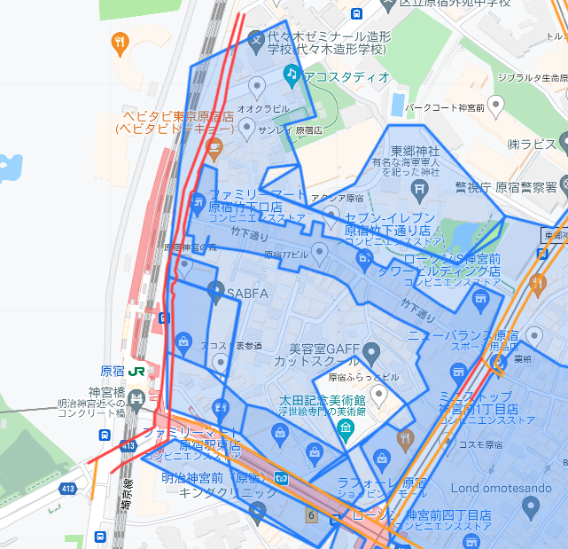
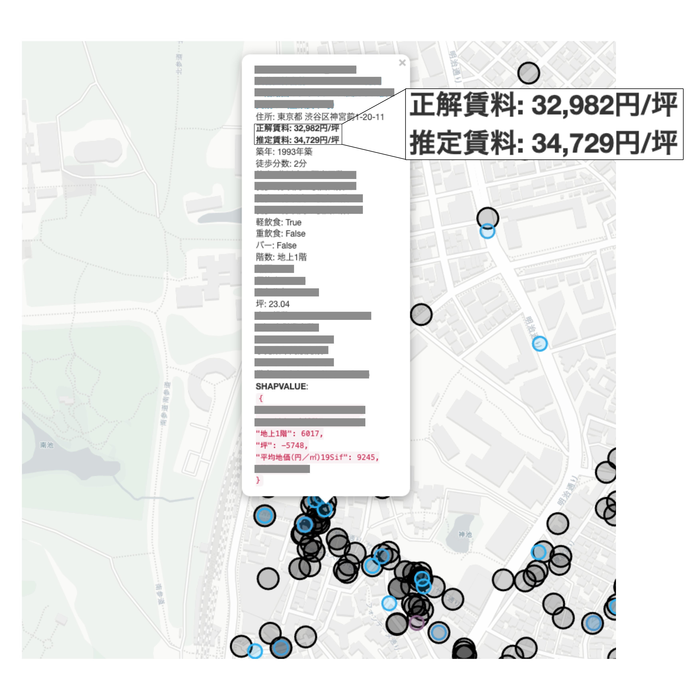

# お話しする内容

## 1. そもそもAIとはなにか
## 2. AIをビジネス価値につなげるにはどうしたら良いか

---
# 自己紹介(経歴)

- NTTドコモ
    - 機械学習エンジニア
    - **通信品質体感の予測分析**
- 不動産テック企業
    - 共同創業, 取締役CTO
    - **オフィスの賃料推定・将来予測モデル開発**など
- 現在

---
# 自己紹介(現在)

- **データインサイト**
    - **社外取締役**
    - **店舗・駐車場などの賃料推定モデル開発**など
- その他
    - プログラミングとギターによる音楽制作など

---
# 本日お伝えしたいこと

---
## AIのビジネス価値は，
## **ビジネスサイドがAI開発に参加するかどうか**で決まる

---

---
# そもそもAIとはなにか    

---

---
# どのAIを使うべきか

## **解きたい課題**によって変わってくる
- **画像が猫かどうか判別したい**
- **物件の賃料を推定したい**

---

## 画像が猫かどうか判別したい
- **深層学習**
    - 猫の画像とそうでない画像を大量に学習させることで判別
    - 「鼻の高さ」「耳の長さ」「目の形」などの**特徴を，人間が設定しなくても学習してくれる**

---

## 物件の賃料を推定したい
- **ルールベース**
    - 周辺の物件の賃料の平均値をとる，など   
- **機械学習**
    - 物件の賃料に影響しそうな特徴(立地や建物のスペックなど)と賃料の組み合わせを学習することで推定
        - どんな特徴量を選定するかが大きな鍵
        - **知識がないと適切な特徴量選定ができない**

---
# 深層学習の事例

- **画像認識**
    - 物体検知
    - 自動運転
- **音声認識**
    - 音声入力, Siri
    - 楽曲から各楽器の音抽出
- **自然言語処理**
    - 翻訳
    - メモから単語の抽出
    - キャッチコピーの自動生成

---
# 機械学習の事例

- **需要予測**
    - タクシーの利用者が多いエリアの予測による売上向上
    - iPhone販売台数の予測による仕入れ最適化
    - 飲食店の来客予測による売上予測
- **故障検知**
    - 基地局の故障検知による点検コストの削減
- **価格推定**
    - 最適な賃料推定
        - 貸主の賃貸収入向上
        - 借主，物件購入検討者の意思決定サポート

---
# AIの社会的なイメージとのギャップ

## イメージ
- データさえあれば学習してくれる
    - **深層学習**のイメージ
## 実際
- ビジネス価値に直結するのは**機械学習**のことが多い
    - **ドメイン知識**をAIに落とし込まないといけない

---
# PoCなどでありがちな失敗
- 目標がビジネス価値に繋がらない曖昧なものになっている
    - 精度目標だけあって、どんな価値として利用するか議論されていない
- 精度が100%でないと成り立たない目標をたててしまう
    - 過去起こらなかった事象についてはAIは学習できない
- **ビジネスサイド(ドメイン知識)が開発に参加していない**
    - 人間が説明不可能なものは機械学習では推定できない
    - 参加はしていても**担当者にドメイン知識がなかったり，社内データについて全く知識がない**ことがある

---
# AIをビジネス価値につなげるにはどうしたら良いか

---
# **ドメインのあるビジネスサイドがAI開発に参加する**

# →ドメイン知識とAI知識が掛け合わされる

---

---

# DIIにおけるアプローチ

## 飲食店の賃料推定

---

## 正解データが感覚に合うか確認

- [**AI**]高い物件ほど赤，安い物件ほど水色と色分けして地図にプロット
- [**Biz**]そもそも**感覚に合うデータなのかどうかまず確認**
    - [**Biz**]目に見える明らかな異常値を抽出
        - 賃料坪単価が100万超えている，など

---

## なぜ大きく正解とズレるのか分析

- [**AI**]原宿の商店街付近の物件が、実際の賃料(坪単価)に対して倍以上の推定結果を出してしまった
- [**Biz**]周囲の正解データの賃料が高い
    - **商店街内部の正解データが付近に多いことが影響している可能性**
- [**AI**]商店街内外の判定を特徴量にいれることで解消されるかもしれない

---

## 商店街の範囲を入力する社内アプリ

- [**AI**]商店街の範囲はデータ化されていないので、商店街や大きな通りを入力できる社内アプリを開発
- [**Biz**]**飲食店・地図の知見を頼り**に入力
- [**AI**]商店街・メイン通りの内外判定をできるようにした

---

## 商店街判定を特徴量に加えた結果

- 推定値と正解賃料の誤差が大幅に改善
- 全体的な精度も向上

---
## **ビジネスサイドとAIエンジニアに求められるスキル・姿勢**

- AIエンジニア
    - **アウトプットの速さ**
    - ドメイン知識を引き出す**可視化技術**
- ビジネスサイド
    - **ドメイン知識を持っている**こと
    - 「**特徴量**」という概念を理解していること
    - (データを提供する側の場合は)**社内データに詳しい**か，詳しい担当者を知っていること
